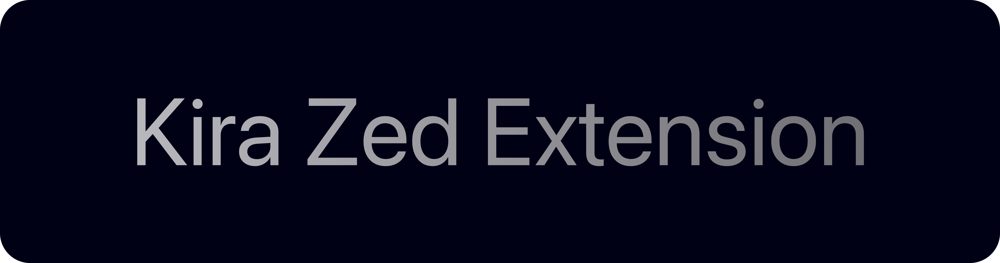

<picture>
  <source media="(prefers-color-scheme: dark)" srcset="Images/KiraZedExtensionDark.png">
  <source media="(prefers-color-scheme: light)" srcset="Images/KiraZedExtensionLight.png">
  
</picture>

# Kira Zed Extension

Zed editor extension for the [Kira programming language](https://github.com/kira-lang-com/kira).
Provides syntax highlighting, bracket matching, and indentation rules for `.kira` files.

## Features

- Syntax highlighting via Tree-sitter
- Bracket matching and auto-close
- Indentation rules
- Comment toggling (`//`)

## Installation

### Dev Install (local)

1. Clone this repository
2. Open Zed → Extensions → Install Dev Extension
3. Select the folder containing `extension.toml`

Make sure you select the extension folder, not the `kira-tree-sitter` repo.

### Publishing

The extension will be published to the Zed marketplace. Once available, search
"Kira" in Zed's extension browser.

## How it Works

This extension connects to the [kira-tree-sitter](https://github.com/kira-lang-com/kira-tree-sitter)
grammar at a pinned commit SHA for reproducible installs. A prebuilt
`grammars/kira.wasm` is bundled with the extension — no local WASM build
tooling required on install.

## Updating the Grammar

When `kira-tree-sitter` is updated:

1. Build the new WASM: `npx tree-sitter build --wasm` in the grammar repo
2. Copy the output to `grammars/kira.wasm` in this repo
3. Update `[grammars.kira].rev` in `extension.toml` to the new commit SHA
4. Commit and push

## Troubleshooting

**"Failed to compile grammar 'kira'"** — Zed is trying to compile the grammar
locally without the bundled WASM. Make sure `grammars/kira.wasm` is present.
If rebuilding, ensure `emcc`, `docker`, or `podman` is available.

**Wrong folder selected** — Install the folder containing `extension.toml`,
not the `kira-tree-sitter` repository.

## Compatibility

Built against `zed_extension_api` version `0.7.0`. Modifying the Rust extension
code requires a Rust toolchain.

## License

MIT